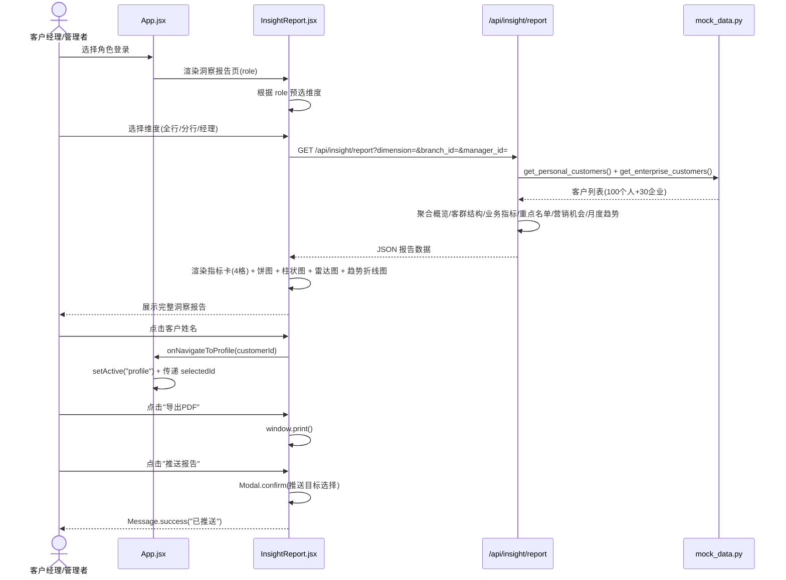
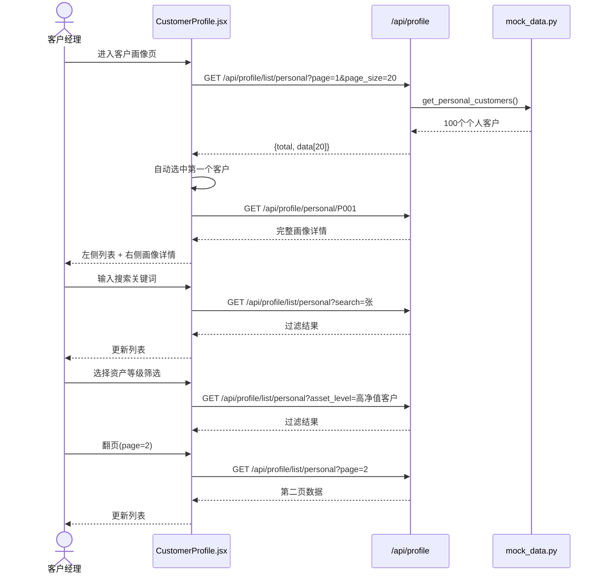
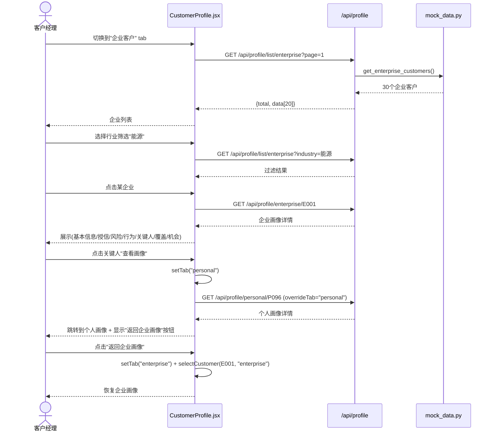
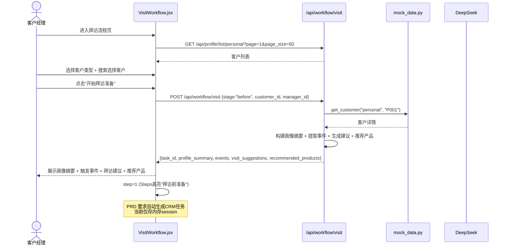
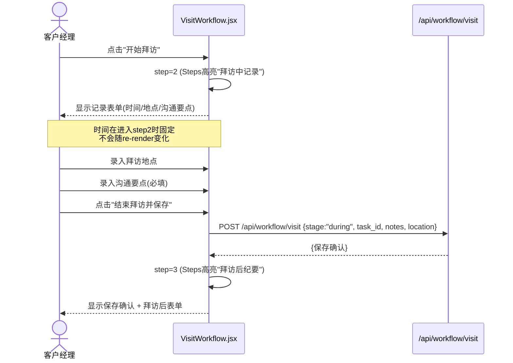
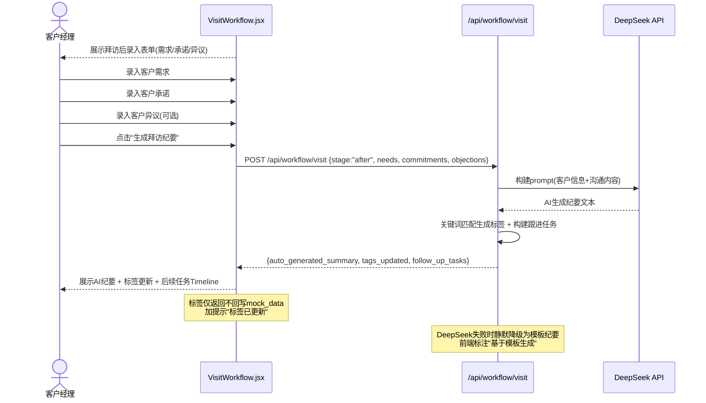
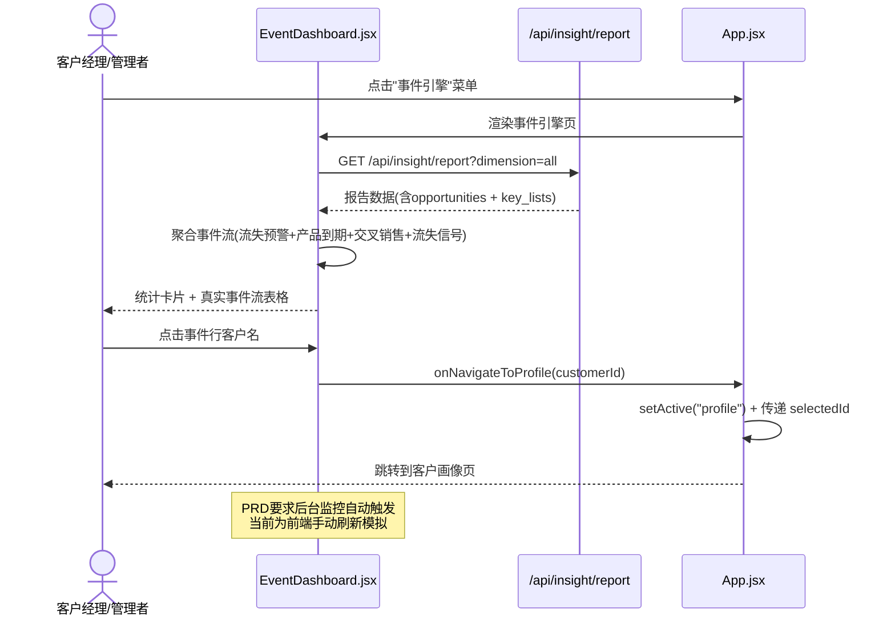
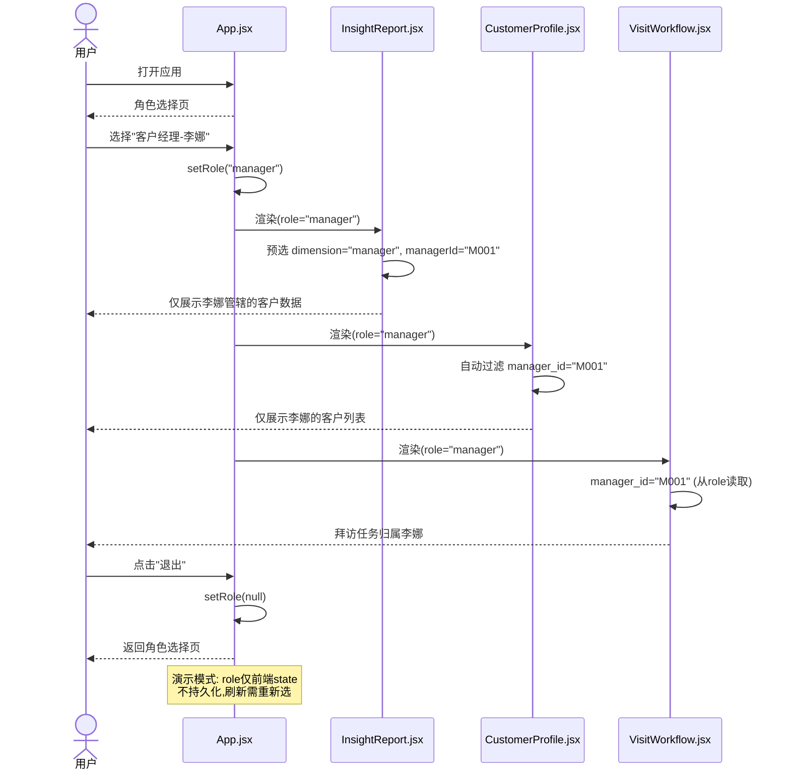

# IntelliBanker 业务流时序图

> 基于 PRD V1.0 梳理的 8 个核心业务流，对照实际代码验证。

---

## 流程1: 客户洞察报告（PRD §2）

---

## 流程2: 个人客户画像查询（PRD §3.1）

---

## 流程3: 企业客户画像查询（PRD §3.2）

---

## 流程4: 拜访前准备（PRD §4.1）

---

## 流程5: 拜访中记录（PRD §4.2）

---

## 流程6: 拜访后处理（PRD §4.3）

---

## 流程7: 事件驱动引擎（PRD §4.4）

---

## 流程8: 角色与权限（PRD §6）

---

## 问题清单

| 编号 | 严重度 | 流程 | 问题 | 状态 |
|------|--------|------|------|------|
| H1 | 高 | 流程3 | 关键人跳转竞态条件 | 已修复 |
| H2 | 高 | 流程1 | 报告中客户不可跳转画像 | 已修复 |
| H3 | 高 | 流程7 | 事件引擎与真实数据脱节 | 已修复 |
| H4 | 高 | 流程7 | 事件无法跳转客户 | 已修复 |
| H5 | 高 | 流程8 | 角色不影响数据范围 | 已修复 |
| M1 | 中 | 流程1 | 维度切换时空请求 | 已修复 |
| M2 | 中 | 流程2 | 分页切换不刷新 | 已修复 |
| M3 | 中 | 流程3 | 跳转后无法返回企业画像 | 已修复 |
| M4 | 中 | 流程4 | manager_id硬编码 | 已修复 |
| M5 | 中 | 流程6 | 标签不回写(加提示) | 已修复 |
| M6 | 中 | 流程3 | 企业缺行业筛选 | 已修复 |
| L1 | 低 | 流程1 | 推送目标不可选 | 已修复 |
| L2 | 低 | 流程5 | 开始时间每次渲染变化 | 已修复 |
| L3 | 低 | 流程6 | AI纪要降级无提示 | 已修复 |
